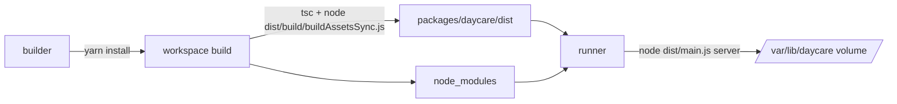

# Docker

Build this image from the repository root so the Docker build can access both `packages/daycare` and `packages/daycare-dashboard`:

```sh
docker build -f packages/daycare/Dockerfile -t daycare-cli .
```

Run it with a persistent data volume:

```sh
docker run --rm -it \
  -p 7331:7331 \
  -p 7332:7332 \
  -v daycare-data:/var/lib/daycare \
  daycare-cli
```

The image uses the package’s normal build flow with `yarn workspace daycare-cli run build`, which compiles TypeScript and runs asset sync from compiled `dist/` via `node`, then starts the built CLI with `node ./packages/daycare/dist/main.js start`.
The runtime command is `node ./packages/daycare/dist/main.js server`, which is the deployment-safe mode and does not require a local Docker socket.

`7331` is the dashboard plugin default port and `7332` is the app server default port. They are only used when those features are enabled in Daycare settings.


