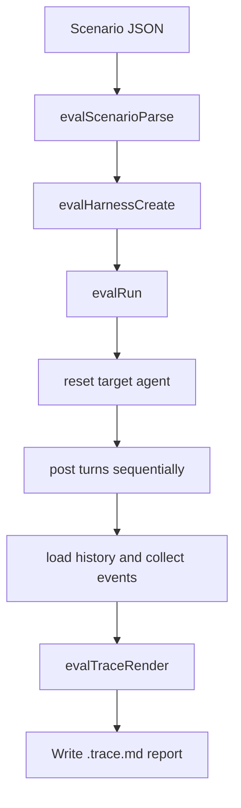

# Eval Harness

## Summary

The eval harness runs a JSON scenario against a real in-process `AgentSystem`, captures the resulting history and engine events, and renders the run as markdown for human review.

The implementation stays local and deterministic:

- storage uses in-memory PGlite
- message delivery uses `postAndAwait()`
- traces come from `agentHistoryLoad()` plus `EngineEventBus`
- the CLI writes a markdown report next to the scenario by default

## Flow

## Supported Agent Kinds

Direct path-addressable kinds supported by the scenario format:

- `connector`
- `agent`
- `app`
- `cron`
- `task`
- `subuser`
- `supervisor`
