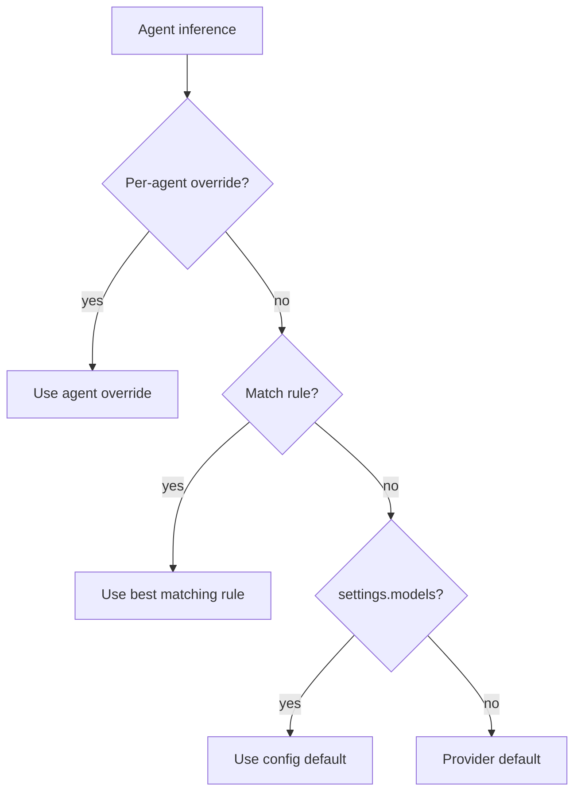

# Model Role Rules

Dynamic, rule-based model resolution that takes effect immediately without server restart.

## Overview

Model role rules let you override which AI model is used for inference based on agent properties. Rules are stored in the database and cached in memory — changes via the API take effect on the next inference call with no reload needed.

## Resolution Priority

When an agent runs inference, the model is resolved in this order:

1. **Per-agent override** — `set_agent_model` tool (stored in agent state)
2. **Most-specific matching rule** — from `model_role_rules` table
3. **Config default** — `settings.models[roleKey]` from `settings.json`
4. **Provider default** — first active provider's default model

## Rule Matchers

Each rule has optional matchers. A rule matches when **all** its non-null matchers equal the corresponding agent context value. Null matchers match anything.

| Matcher   | Matches against         | Values |
|-----------|------------------------|--------|
| `role`    | Agent's model role key | `user`, `memory`, `memorySearch`, `subagent`, `task` |
| `kind`    | Agent's kind           | `connector`, `agent`, `app`, `cron`, `task`, `subuser`, `sub`, `memory`, `search` |
| `userId`  | Owner user ID          | Any user ID string |
| `agentId` | Specific agent ID      | Any agent ID string |

**Relationship:** `role` is derived from `kind` (e.g., connector/agent/app → `user`, sub → `subagent`). Use `role` for broad targeting, `kind` for narrow.

## Specificity

Among matching rules, the most specific wins:

- **Score** = count of non-null matchers
- **Tie-break** = most recently created rule

```
{ model: "..." }                              → score 0 (wildcard)
{ role: "user", model: "..." }                → score 1
{ role: "user", kind: "connector", model: "..." } → score 2
{ userId: "abc", role: "user", kind: "connector", model: "..." } → score 3
```

## API Endpoints

All endpoints are on the engine IPC server (Fastify, Unix socket).

### List rules

```
GET /v1/engine/model-roles
→ { ok: true, rules: ModelRoleRule[] }
```

### Set (create or update) a rule

```
POST /v1/engine/model-roles/set
{
  "id": "optional-id",      // omit to create, provide to update
  "role": "user",            // optional matcher
  "kind": "connector",       // optional matcher
  "userId": "abc123",        // optional matcher
  "agentId": "xyz789",       // optional matcher
  "model": "anthropic/claude-opus-4-6"  // required
}
→ { ok: true, rule: ModelRoleRule }
```

### Delete a rule

```
POST /v1/engine/model-roles/delete
{ "id": "rule-id" }
→ { ok: true, deleted: boolean }
```

## CLI

Override rules are managed interactively via the `daycare models` command. When the engine is running, the command displays current rules and offers "Add/Edit/Delete override rule" actions in the interactive menu.

```bash
daycare models          # interactive — shows settings + rules, pick action
daycare models --list   # non-interactive — print current state
```

## Examples

**All user-facing agents use Opus:**
```json
{ "role": "user", "model": "anthropic/claude-opus-4-6" }
```

**Memory agents use Haiku:**
```json
{ "role": "memory", "model": "anthropic/claude-haiku-4-5" }
```

**Specific user's connector agents use GPT-4:**
```json
{ "userId": "abc", "kind": "connector", "model": "openai/gpt-4" }
```

**Global default (lowest priority):**
```json
{ "model": "anthropic/claude-sonnet-4-6" }
```

## Database

Rules are stored in the `model_role_rules` table and cached in-memory by the `ModelRoles` facade. The cache is refreshed on startup via `ModelRoles.load()`.


