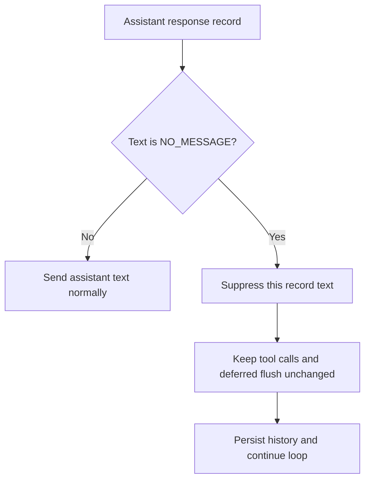

# NO_MESSAGE Text-Only Suppression

## Summary

`NO_MESSAGE` suppresses user-visible text from that specific assistant record only.

Everything else in the turn continues normally:

- run_python execution
- tool calls
- deferred payload flush/side effects
- history persistence
- assistant content record remains unchanged (no text block stripping)

## Flow

