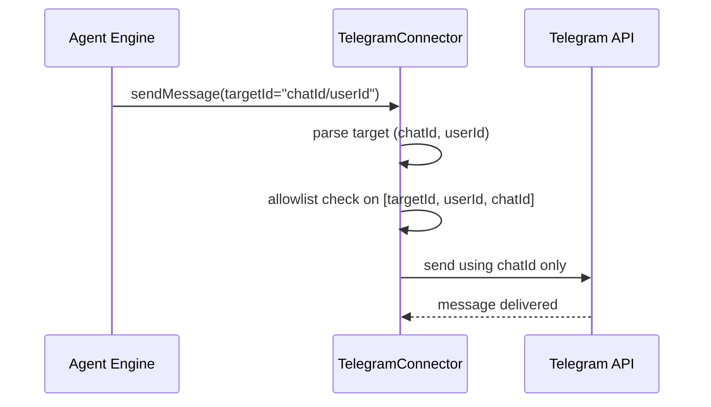

# Telegram Composite Target Allowlist

## Summary

Telegram connector targets can be stored as `chatId/userId` (for example `-100123/456` or `215026574/215026574`).

This change normalizes outbound Telegram targets to `chatId` for API calls and checks allowlist eligibility against multiple candidates:
- full target (`chatId/userId`)
- sender user id (`userId`)
- chat id (`chatId`)

This prevents false "unapproved uid" blocks for users who already sent messages.

## Flow

