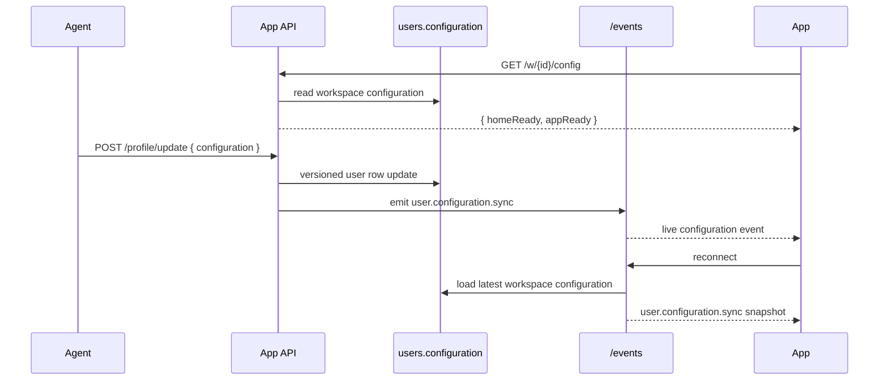

# User Configuration Flags

The app shell is controlled by a JSON object stored on `users.configuration`.
These flags are **workspace-scoped** — they are read from the workspace user record, not the authenticated caller.

Initial shape:

```json
{
    "homeReady": false,
    "appReady": false
}
```

Behavior:

- `homeReady`: switches between onboarding-style home and the real home view.
- `appReady`: controls whether navigation chrome such as sidebars is visible.
- Missing or malformed stored values normalize back to `false`.
- `GET /config` (workspace-scoped) returns the workspace's configuration.
- `POST /profile/update` accepts partial `configuration` updates and merges them into the current value.
- `GET /events` always emits the latest workspace configuration snapshot on connect, then forwards live `user.configuration.sync` updates.

## App loading order

1. Workspace resolved from URL
2. `GET /w/{workspaceId}/config` fetched — blocks rendering until loaded
3. SSE connects to `/w/{workspaceId}/events` — receives initial config snapshot + live updates
4. `appReady` controls sidebar/chrome visibility (desktop: workspace strip + sidebar + chat panel; mobile: drawer + hamburger)
5. `homeReady` controls home route: `HomeView` when true, `OnboardingView` when false


