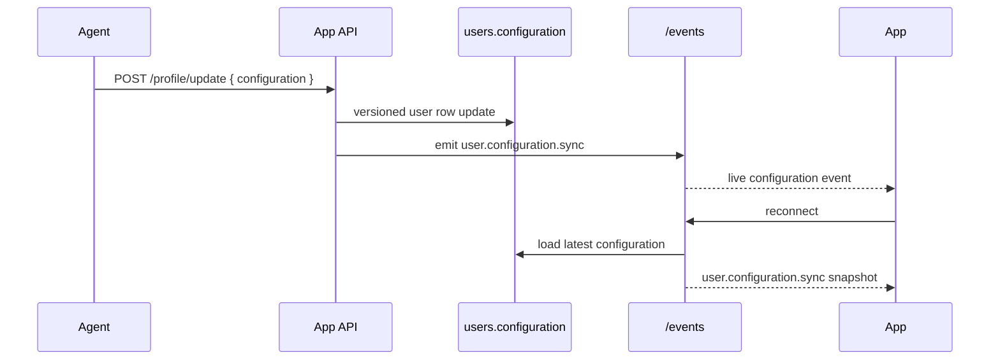

# User Configuration Flags

The app shell is controlled by a JSON object stored on `users.configuration`.

Initial shape:

```json
{
    "homeReady": false,
    "appReady": false
}
```

Behavior:

- `homeReady`: switches between onboarding-style home and the real home view.
- `appReady`: controls whether navigation chrome such as sidebars is visible.
- Missing or malformed stored values normalize back to `false`.
- `POST /profile/update` accepts partial `configuration` updates and merges them into the current value.
- `GET /events` always emits the latest configuration snapshot on connect, then forwards live `user.configuration.sync` updates.


