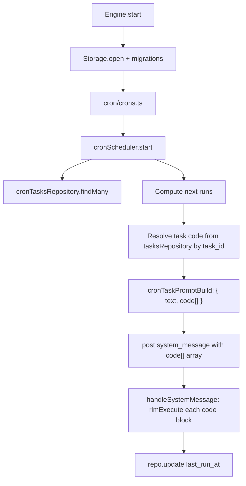

# Cron Module

Cron is now a trigger scheduler. Python code lives in unified `tasks` rows, while `tasks_cron` stores trigger metadata.

## Structure

```
cron/
├── cronTypes.ts
├── ops/
│   ├── cronExpressionParse.ts
│   ├── cronFieldMatch.ts
│   ├── cronFieldParse.ts
│   ├── cronTimeGetNext.ts
│   └── cronScheduler.ts
├── crons.ts
└── README.md
```

## Storage

Cron triggers are stored in `tasks_cron` with key fields:
- `id`: trigger id (`daily-report`)
- `task_id`: foreign key to unified task (`tasks.id`)
- `name`, `schedule`, `agent_id`
- `enabled`, `delete_after_run`
- `last_run_at` (unix ms)

`CronScheduler` always resolves runtime code from `tasks.code` using required `task_id`.

## Execution Flow

At execution time, cron routes to the `system:cron` agent (or explicit `agentId`) with one Python code block. The code source of truth is `tasks.code`.



## Tools

Cron-specific tools were replaced by unified task tools:
- `task_create`, `task_read`, `task_update`, `task_delete`, `task_run`
- `task_trigger_add`, `task_trigger_remove`
