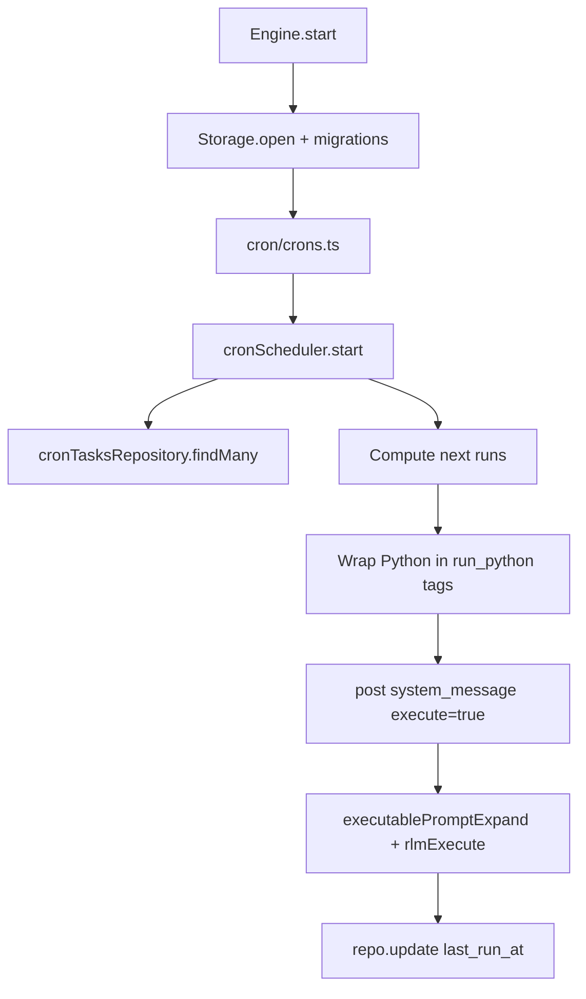

# Cron Module

Cron tasks store Python code in SQLite (`tasks_cron`) and are scheduled in-memory by `CronScheduler`.

## Structure

```
cron/
├── cronTypes.ts
├── ops/
│   ├── cronExpressionParse.ts
│   ├── cronFieldMatch.ts
│   ├── cronFieldParse.ts
│   ├── cronTimeGetNext.ts
│   └── cronScheduler.ts
├── crons.ts
└── README.md
```

## Storage

Tasks are stored in `tasks_cron` with key fields:
- `id`: human task id (`daily-report`)
- `task_uid`: cron descriptor id (cuid2)
- `name`, `schedule`, `prompt` (Python code)
- `enabled`, `delete_after_run`
- `last_run_at` (unix ms)

The runtime uses `CronTasksRepository` for CRUD and cached reads.

## Execution Flow

Task code is stored as raw Python. At execution time, `cronTaskPromptBuild` wraps the code in `<run_python>` tags so the existing executable-prompt pipeline handles it.



## Tools

- `cron_add` creates/updates a cron task with Python code
- `cron_read_task` reads task definition and code
- `cron_delete_task` removes a task from scheduler + SQLite
