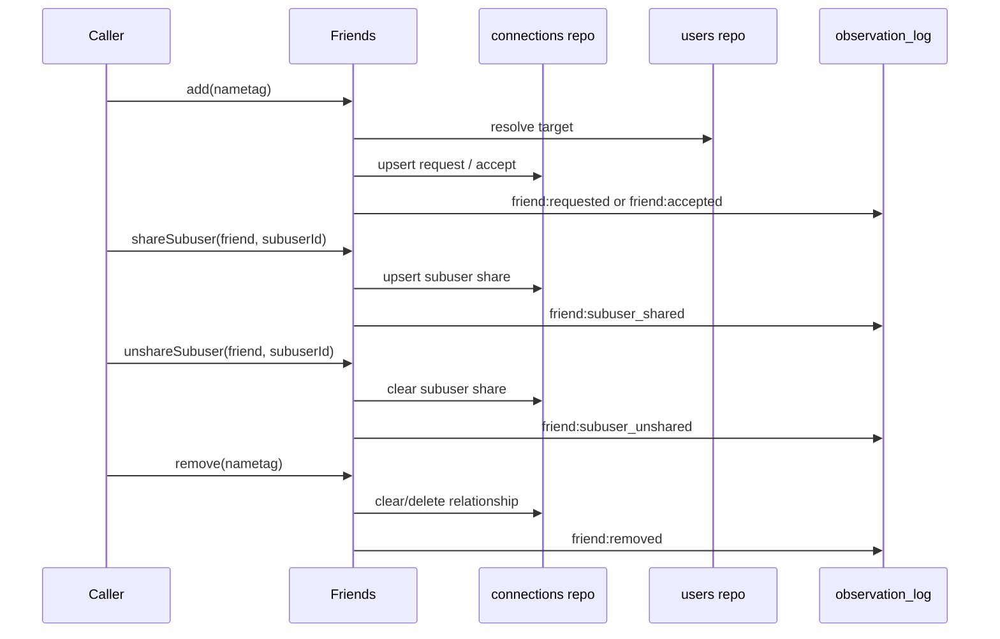

# Friends facade

`Friends` coordinates friendship and subuser-sharing relationship mutations.

## Responsibilities

- Create and accept friend requests.
- Remove/reject/cancel friendships.
- Share and unshare subusers with friends.
- Send user-facing system messages for relationship changes.
- Emit topography observations for all friend/share mutations.

## Public API

- `add(ctx, { nametag })`
- `remove(ctx, { nametag })`
- `shareSubuser(ctx, { friendNametag, subuserId })`
- `unshareSubuser(ctx, { friendNametag, subuserId })`

## Observation Events

Source: `system:friends`

- `friend:requested`
- `friend:accepted`
- `friend:removed`
- `friend:subuser_shared`
- `friend:subuser_unshared`

Events are emitted with scope IDs containing both participant user IDs so query by either side can match via `scopeIds`.

## Flow

