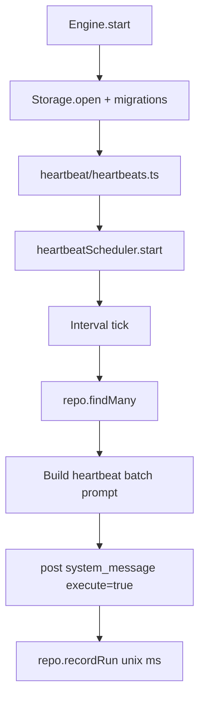

# Heartbeat Module

Heartbeat tasks are persisted in SQLite (`tasks_heartbeat`) and executed as a batch on a fixed interval.

## Structure

```
heartbeat/
├── heartbeatTypes.ts
├── ops/
│   ├── heartbeatPromptBuildBatch.ts
│   └── heartbeatScheduler.ts
├── heartbeats.ts
└── README.md
```

## Storage

Heartbeat rows live in `tasks_heartbeat`:
- `id`, `title`, `prompt`
- `last_run_at` (unix ms)
- `created_at`, `updated_at`

The runtime uses `HeartbeatTasksRepository` for CRUD and `recordRun()` updates.

## Execution Flow



## Tools

- `heartbeat_add` creates/updates heartbeat tasks in SQLite
- `heartbeat_run` runs matching heartbeat tasks immediately
- `heartbeat_remove` deletes a heartbeat task
