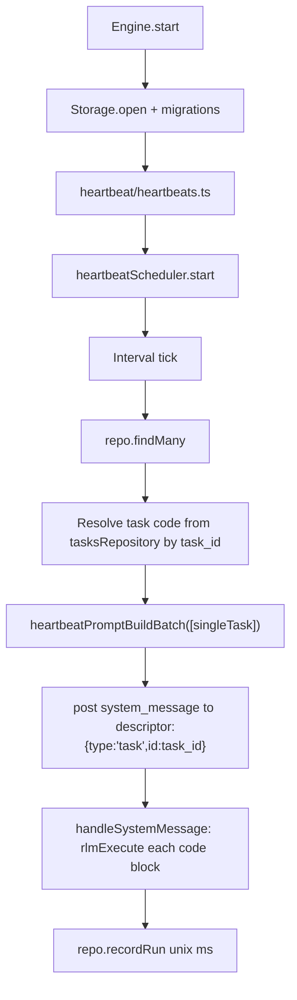

# Heartbeat Module

Heartbeat is now a trigger scheduler. Python code lives in unified `tasks` rows, while `tasks_heartbeat` stores trigger metadata.

## Structure

```
heartbeat/
├── heartbeatTypes.ts
├── ops/
│   ├── heartbeatPromptBuildBatch.ts
│   └── heartbeatScheduler.ts
├── heartbeats.ts
└── README.md
```

## Storage

Heartbeat triggers live in `tasks_heartbeat`:
- `id`, `task_id`, `title`
- `last_run_at` (unix ms)
- `created_at`, `updated_at`

`HeartbeatScheduler` always resolves runtime code from `tasks.code` using required `task_id`.

## Execution Flow

Heartbeat posts each trigger to its own task-scoped descriptor `{ type: "task", id: task_id }`. Runtime code comes from `tasks.code`. The code either produces text output (becomes an LLM prompt) or calls tools and `skip()` to suppress LLM inference.



## Tools

Heartbeat-specific tools were replaced by unified task tools:
- `task_create`, `task_read`, `task_update`, `task_delete`, `task_run`
- `task_trigger_add`, `task_trigger_remove`
