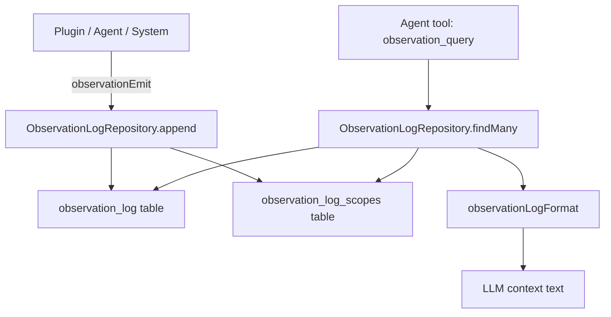

# Observation Log

Append-only event log scoped per user and arbitrary entity IDs. Serves both agent reasoning ("what happened to task X?") and human debugging/audit.

## Event Structure

| Field      | Type       | Description                                              |
|------------|------------|----------------------------------------------------------|
| id         | string     | Unique cuid2 identifier                                  |
| userId     | string     | Owner user                                               |
| type       | string     | Event classification (e.g. `task.updated`)               |
| source     | string     | Colon-delimited origin (`agent:abc`, `plugin:telegram`)  |
| message    | string     | Short one-line summary                                   |
| details    | string?    | Full multi-line description                              |
| data       | unknown?   | Arbitrary JSON payload                                   |
| scopeIds   | string[]   | Entity IDs this event relates to                         |
| createdAt  | number     | Unix ms timestamp                                        |

## Source Format

`<category>:<identifier>`:
- `plugin:<pluginId>` — plugin events
- `system:<subsystem>` — system events (cron, heartbeat)
- `agent:<agentId>` — agent events
- `memory:<agentId>` — memory system events

## Emitting Observations

```typescript
import { observationEmit } from "@/types";

await observationEmit(storage.observationLog, {
    userId: ctx.userId,
    type: "task.completed",
    source: `agent:${agentId}`,
    message: "Task marked as done",
    details: "The agent finished processing all subtasks.",
    data: { taskId: "t1", duration: 5000 },
    scopeIds: ["t1", agentId]
});
```

## Querying

The `observation_query` tool is available to agents. It supports:
- **scopeIds**: filter events by entity (matches ANY)
- **type**: exact event type match
- **source**: prefix match (`agent:` matches all agent sources)
- **afterDate/beforeDate**: date range (unix ms)
- **limit/offset**: pagination
- **mode**: output format — `short` (default), `full`, or `json`

## Data Flow



## Database Schema

Two tables:
- `observation_log` — main event rows (PK: `id`)
- `observation_log_scopes` — junction table for scope IDs (PK: `observation_id, scope_id`)

Scope queries use a subquery join: find observation IDs matching any requested scope, then filter the main table.
