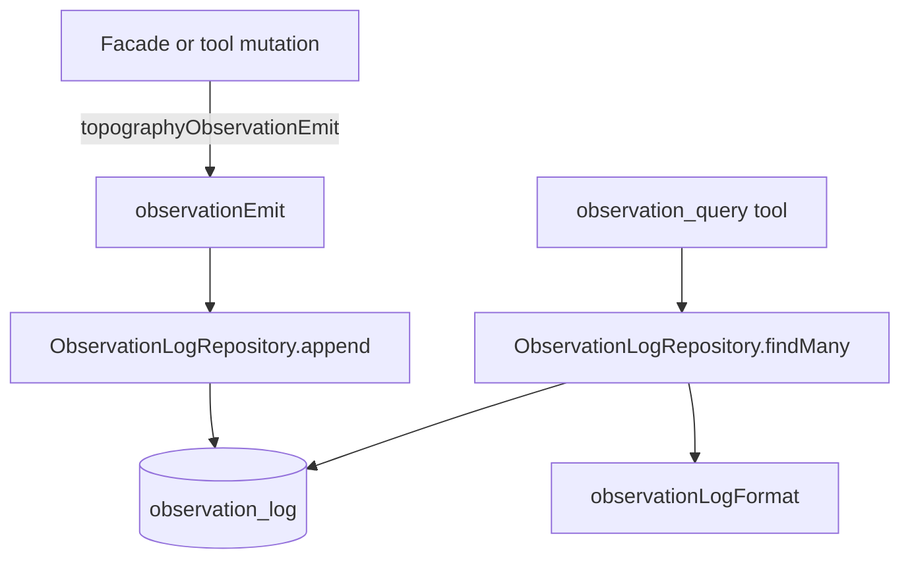

# Observation Log

Append-only event log scoped per user and arbitrary entity IDs. It supports agent reasoning ("what changed?") and audit/debug views.

## Event Structure

| Field | Type | Description |
| --- | --- | --- |
| id | string | Unique cuid2 identifier |
| userId | string | Owner user |
| type | string | Event type (`<domain>:<action>`) |
| source | string | Origin (`system:*`, `plugin:*`, `agent:*`, ...) |
| message | string | Short summary |
| details | string \| null | Long-form details |
| data | unknown | JSON payload |
| scopeIds | string[] | Related entity IDs for scope queries |
| createdAt | number | Unix milliseconds |

## Topography Event Catalog

Topography events are defined in `observations/topographyEvents.ts` and emitted through `topographyObservationEmit(...)`.

### `system:agents`
- `agent:created` — `{ agentId, userId, descriptorType, label, parentAgentId? }`
- `agent:updated` — `{ agentId, userId, descriptorType, label }`
- `agent:lifecycle` — `{ agentId, userId, lifecycle, label }`

### `system:tasks`
- `task:created` — `{ taskId, userId, title, description }`
- `task:updated` — `{ taskId, userId, title, description, changes }`
- `task:deleted` — `{ taskId, userId, title }`

### `system:crons`
- `cron:added` — `{ cronId, taskId, userId, name, schedule, timezone }`
- `cron:deleted` — `{ cronId, taskId, userId, name }`
- `cron:enabled` — `{ cronId, taskId, userId, name }`
- `cron:disabled` — `{ cronId, taskId, userId, name }`

### `system:webhooks`
- `webhook:added` — `{ webhookId, taskId, userId, name, path }`
- `webhook:deleted` — `{ webhookId, taskId, userId, name }`

### `system:signals`
- `signal:subscribed` — `{ agentId, userId, pattern, silent }`
- `signal:unsubscribed` — `{ agentId, userId, pattern }`

### `system:channels`
- `channel:created` — `{ channelId, userId, name, leader }`
- `channel:deleted` — `{ channelId, userId, name, memberCount }`
- `channel:member_joined` — `{ channelId, userId, name, agentId, username }`
- `channel:member_left` — `{ channelId, userId, name, agentId, username }`

### `system:exposes`
- `expose:created` — `{ exposeId, userId, domain, target, provider, mode, authenticated }`
- `expose:removed` — `{ exposeId, userId, domain }`
- `expose:updated` — `{ exposeId, userId, domain, target, provider, mode, authenticated }`

### `system:secrets`
- `secret:added` — `{ userId, name, displayName, variableNames }`
- `secret:removed` — `{ userId, name, displayName }`

### `system:subusers`
- `subuser:created` — `{ subuserId, ownerUserId, name, nametag, gatewayAgentId }`
- `subuser:configured` — `{ subuserId, ownerUserId, name, gatewayAgentId }`

### `system:friends`
- `friend:requested` — `{ fromUserId, toUserId, toNametag }`
- `friend:accepted` — `{ userAId, userBId, nametag }`
- `friend:removed` — `{ userAId, userBId, nametag }`
- `friend:subuser_shared` — `{ subuserId, subuserName, ownerUserId, friendUserId, friendNametag }`
- `friend:subuser_unshared` — `{ subuserId, subuserName, ownerUserId, friendUserId, friendNametag }`

## Source Format

`<category>:<identifier>`:
- `plugin:<pluginId>` — plugin events
- `system:<subsystem>` — system events (cron, webhook)
- `agent:<agentId>` — agent events
- `memory:<agentId>` — memory system events

## Emitting Observations

```typescript
import { observationEmit } from "@/types";

await observationEmit(storage.observationLog, {
    userId: ctx.userId,
    type: "task.completed",
    source: `agent:${agentId}`,
    message: "Task marked as done",
    details: "The agent finished processing all subtasks.",
    data: { taskId: "t1", duration: 5000 },
    scopeIds: ["t1", agentId]
});
```

## Querying

The `observation_query` tool supports:
- `scopeIds`: overlap query against `scope_ids`
- `type`: exact match
- `source`: prefix match
- `afterDate` / `beforeDate`: unix ms range
- `limit` / `offset`: pagination
- `mode`: `short` (default), `full`, `json`

## Data Flow


