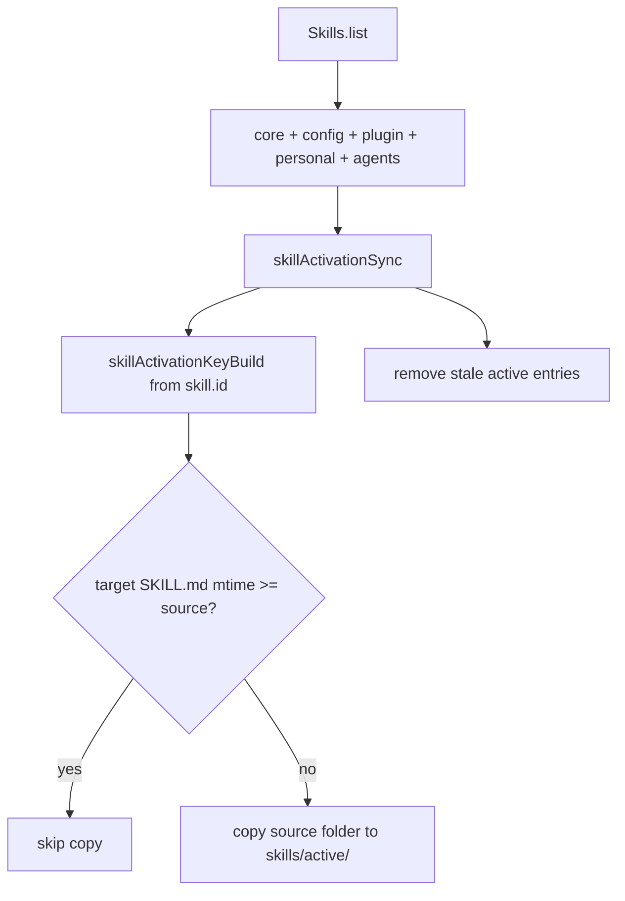

# Skills Engine Module

The skills module discovers skill metadata, builds the system prompt list, and syncs runnable skill copies into a user-scoped active directory.

## Sources

`Skills.list()` combines:

- core: `packages/daycare/sources/skills/`
- config: `<configDir>/skills/`
- plugin: plugin-registered `SKILL.md` paths
- user personal: `<usersDir>/<userId>/skills/personal/`
- agents shared: `~/.agents/skills/`

## Activation Copy Flow

Before each inference call, `Skills.syncToActive()` copies all listed skills to `<usersDir>/<userId>/skills/active/<activationKey>/`.

- `activationKey` is derived from `skill.id`
- unchanged skills are skipped by `mtime` check
- removed skills are deleted from `skills/active`
- only skills with valid `name` frontmatter are copied

## Tool Loading

The `skill` tool loads named skills from `skills/active/<activationKey>/SKILL.md`.

- host mode prepends `Base directory for this skill: <host-active-path>/<activationKey>`
- Docker mode prepends `Base directory for this skill: /shared/skills/<activationKey>`
