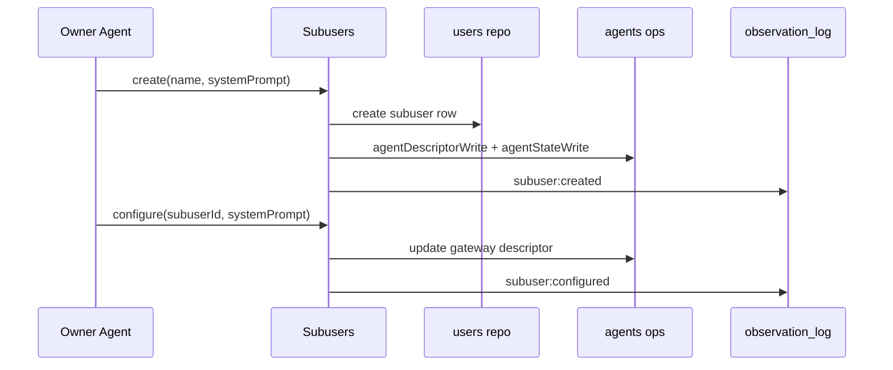

# Subusers facade

`Subusers` centralizes owner-managed subuser lifecycle operations.

## Responsibilities

- Validate caller is the owner user.
- Create subuser users and homes.
- Create/configure subuser gateway agent descriptors.
- Initialize gateway agent state/session.
- Emit topography observations for create/configure operations.

## Public API

- `create(ctx, { name, systemPrompt })`
- `configure(ctx, { subuserId, systemPrompt })`

## Observation Events

Source: `system:subusers`

- `subuser:created`
- `subuser:configured`

Both events are written under the owner `userId` with scope IDs `[ownerUserId, subuserId]`.

## Flow

