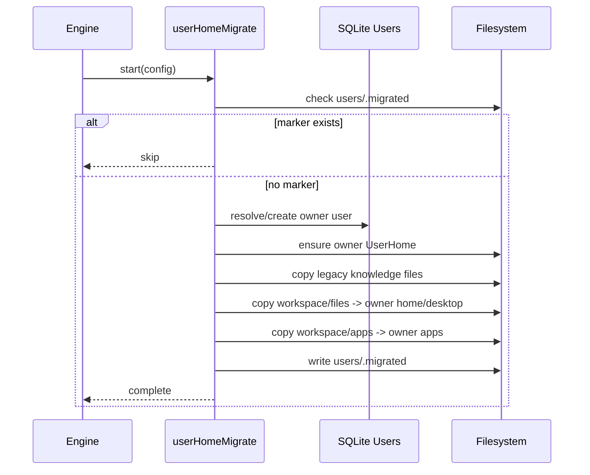

# Users Engine Module

This module provides per-user filesystem isolation under `config.usersDir`:

```text
<dataDir>/users/<userId>/
  skills/
  apps/
    <app-id>/
      APP.md
      PERMISSIONS.md
      data/
      state.json
  home/
    downloads/
    desktop/
    documents/
    developer/
    tmp/
    knowledge/
      SOUL.md
      USER.md
      AGENTS.md
      TOOLS.md
      MEMORY.md
```

## Components

- `userHome.ts`: `UserHome` facade for user-scoped path resolution.
- `userHomeEnsure.ts`: creates user directory tree and seeds knowledge markdown files.
- `userHomeMigrate.ts`: one-time migration from legacy shared storage into owner user home.

## Resolution Flow

```mermaid
flowchart TD
    A[AgentSystem resolves userId] --> B[UserHome(usersDir, userId)]
    B --> C[userHomeEnsure]
    C --> D[skills, apps, home/* directories]
    C --> E[knowledge files ensured]
    B --> F[permissionBuildUser]
    F --> G[Agent session permissions]
    B --> H[Agent files facade: home/downloads, home/desktop, home/tmp]
    B --> I[prompt paths: home/knowledge/*.md]
```

## Migration Flow


