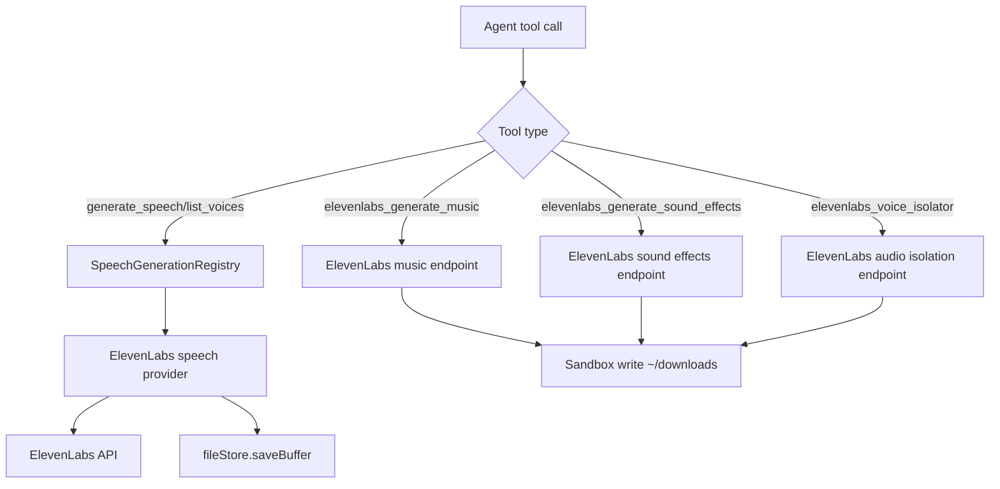

# ElevenLabs Plugin

The `elevenlabs` plugin provides:

- speech provider wiring for `generate_speech` and `list_voices`
- direct audio tools with `elevenlabs_` names:
  - `elevenlabs_generate_music`
  - `elevenlabs_generate_sound_effects`
  - `elevenlabs_voice_isolator`

## What it does

- Registers a `SpeechGenerationProvider` via `registerSpeechProvider()`
- Uses ElevenLabs text-to-speech for provider `generate()`
- Uses a hardcoded voice catalog (`id` + `description`) for `listVoices()`
- Registers direct tools for music generation, sound effects, and voice isolation
- Writes direct-tool audio files to `~/downloads` in sandbox

## Settings

- `model` (optional): default TTS model (`eleven_multilingual_v2`)
- `voice` (optional): default voice id (`21m00Tcm4TlvDq8ikWAM`)
- `outputFormat` (optional): default TTS output format (`mp3_44100_128`)
  - TTS shorthand aliases: `mp3`/`mpeg` -> `mp3_44100_128`, `wav` -> `wav_44100`
- `providerId` (optional): registered speech provider id (defaults to plugin id)
- `label` (optional): provider label shown in registry
- `authId` (optional): auth key id used to read API token (defaults to `elevenlabs`)
- `voices` (optional): hardcoded catalog entries for `list_voices`
  - item shape: `{ id: string, description: string }`
  - defaults to built-in catalog from `voiceCatalog.ts`

## Auth

On onboarding, the plugin prompts for an ElevenLabs API key and stores it in auth store under `authId` (`elevenlabs` by default).

## Runtime flow

