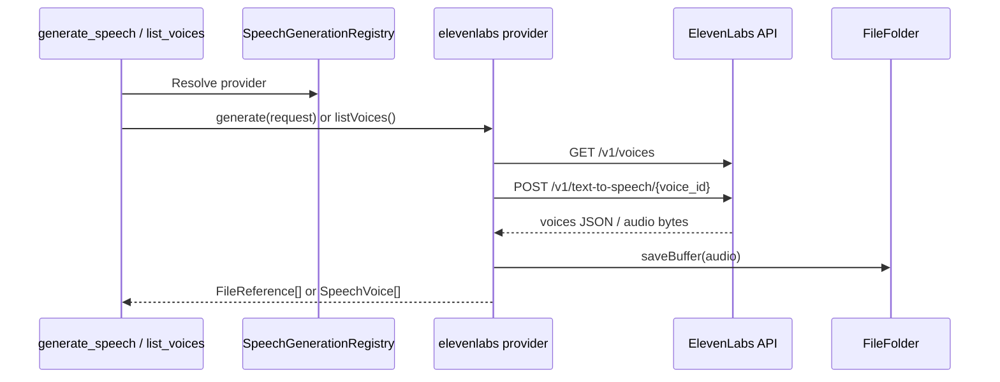

# ElevenLabs Plugin

The `elevenlabs` plugin registers a `SpeechGenerationProvider` for speech synthesis and voice discovery.

## What it does

- Registers a speech provider via `registerSpeechProvider()`
- Implements `generate()` using ElevenLabs text-to-speech API
- Implements `listVoices()` using ElevenLabs voices API
- Saves generated audio via `fileStore.saveBuffer()`

## Settings

- `model` (optional): default TTS model (`eleven_multilingual_v2`)
- `voice` (optional): default voice id or name (`Rachel`)
- `outputFormat` (optional): default ElevenLabs output format (`mp3_44100_128`)
- `providerId` (optional): registered provider id (defaults to plugin id)
- `label` (optional): provider label shown in registry
- `authId` (optional): auth key id used to read the API token (defaults to `elevenlabs`)

## Auth

On onboarding, the plugin prompts for an ElevenLabs API key and stores it in auth store under `elevenlabs`.

## Runtime flow

