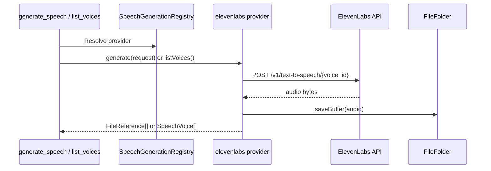

# ElevenLabs Plugin

The `elevenlabs` plugin registers a `SpeechGenerationProvider` for speech synthesis and voice discovery.

## What it does

- Registers a speech provider via `registerSpeechProvider()`
- Implements `generate()` using ElevenLabs text-to-speech API
- Implements `listVoices()` using a local voice catalog (`id` + `description`)
- Saves generated audio via `fileStore.saveBuffer()`

## Settings

- `model` (optional): default TTS model (`eleven_multilingual_v2`)
- `voice` (optional): default voice id (`21m00Tcm4TlvDq8ikWAM`)
- `outputFormat` (optional): default ElevenLabs output format (`mp3_44100_128`)
  - Supports shorthands: `mp3`/`mpeg` -> `mp3_44100_128`, `wav` -> `wav_44100`
- `providerId` (optional): registered provider id (defaults to plugin id)
- `label` (optional): provider label shown in registry
- `authId` (optional): auth key id used to read the API token (defaults to `elevenlabs`)
- `voices` (optional): hardcoded voice catalog entries used by `list_voices`
  - item shape: `{ id: string, description: string }`
  - defaults to built-in catalog from `voiceCatalog.ts`

## Auth

On onboarding, the plugin prompts for an ElevenLabs API key and stores it in auth store under `elevenlabs`.

## Runtime flow

