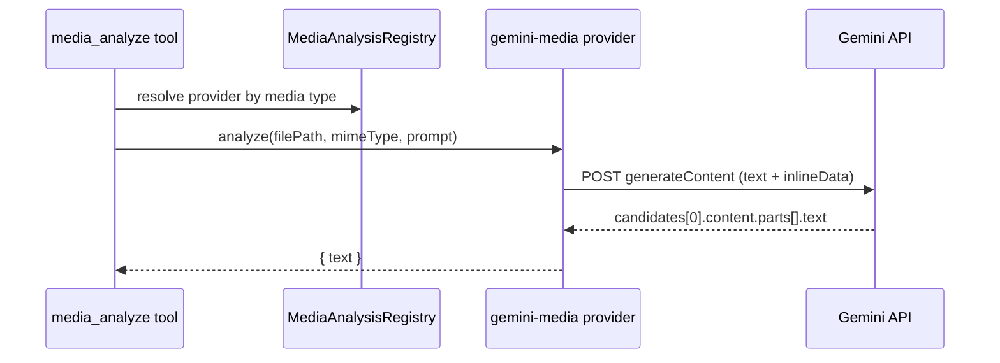

# Media Analysis Plugin

The `gemini-media` plugin registers a `MediaAnalysisProvider` backed by Gemini `generateContent` with `inlineData` inputs.

## What it does

- Accepts image, video, audio, and PDF files
- Reads the file bytes from disk at analysis time
- Sends `{ text: prompt } + { inlineData }` to Gemini
- Returns concatenated text parts from the first candidate

## Settings

- `model` (optional): default model when request does not override (`gemini-3-flash-preview`)
- `baseUrl` (optional): Gemini API base URL (`https://generativelanguage.googleapis.com/v1beta`)
- `providerId` (optional): registered provider id (defaults to plugin id)
- `label` (optional): provider label shown in registry state
- `authId` (optional): auth key used to read API key (defaults to `google`)
- `supportedTypes` (optional): subset of `image`, `video`, `audio`, `pdf` (defaults to all)
- `maxFileSizeBytes` (optional): max file size for inline Gemini payloads (default `20971520`)
- `requestTimeoutMs` (optional): request timeout for Gemini `generateContent` calls (default `60000`)

## Runtime flow

