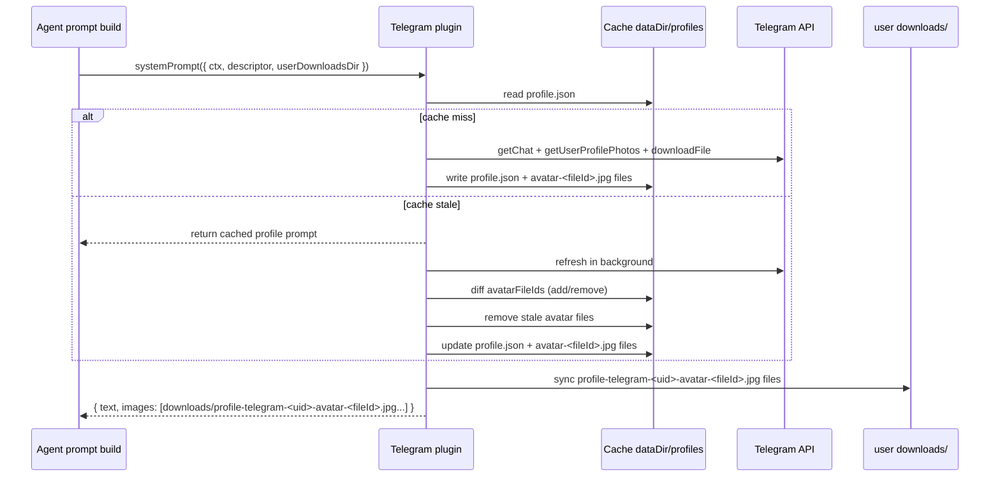

# Telegram plugin

## Overview
The Telegram plugin connects the engine to Telegram via long polling. It only processes private chats and ignores group/supergroup/channel traffic.
It normalizes incoming messages into `ConnectorMessage` objects and sends responses (including files) back to Telegram.

## Files
- `plugin.ts` - plugin wiring and onboarding.
- `connector.ts` - TelegramBot adapter, polling logic, and message normalization.
- `profileFetch.ts` - fetches Telegram profile metadata and all profile avatars.
- `profileCache.ts` - disk cache helpers (`dataDir/profiles/<telegramUserId>/profile.json`).
- `profileAvatarEnsure.ts` - keeps per-avatar copies in user downloads and removes stale copies.
- `profileRender.ts` - renders markdown + image paths for plugin system prompt output.

## Settings
- `mode` (optional): `"private"` (default) or `"public"`.
- `allowedUids` (conditionally required): list of Telegram user IDs that are allowed to interact with the bot when mode is `"private"`.
- `polling` (optional): enable/disable polling (default true).
- `clearWebhook` (optional): clear Telegram webhook before polling (default true).
- `statePath` (optional): override `lastUpdateId` storage path (default `${dataDir}/telegram-offset.json`).

## Auth
- Onboarding prompts for the bot token and stores it in the auth store under the plugin instance id.

## Incoming message handling
- Only accepts `message.chat.type === "private"`.
- In `"private"` mode, rejects users not listed in `allowedUids` with an explicit unauthorized message.
- In `"public"` mode, skips allowlist checks and allows all Telegram users.
- Extracts text or caption and downloads attached photos/documents into the file store.
- Builds `MessageContext` with `messageId` only and emits a user descriptor for targeting.
- Emits normalized payloads to agent handling.

## Outgoing message handling
- Sends text replies with `reply_to_message_id` when present.
- Sends images with `sendPhoto` and other files with `sendDocument`.
- Supports typing indicators and emoji reactions.

## Slash commands
- Receives slash command definitions dynamically via `updateCommands(commands)`.
- Debounces Telegram `setMyCommands` updates by 1 second.
- Initial command sync is triggered from plugin `postStart()` so command registration happens after startup plugin loading.
- Core commands currently include: `/reset`, `/context`, `/compact`, and `/abort`.

## Persistence
- Tracks the last processed Telegram `update_id` and persists it to the configured state file.
- Caches per-user profile data in `dataDir/profiles/<telegramUserId>/profile.json`.
- Caches each profile avatar as `dataDir/profiles/<telegramUserId>/avatar-<fileId>.jpg`.

## System prompt profile sync
- Implements `systemPrompt(context)` and returns a `PluginSystemPromptResult` with markdown text and optional image paths.
- Applies only to descriptors where `descriptor.type === "user"` and `descriptor.connector === "telegram"`.
- First request for a Telegram user blocks and fetches profile data from Telegram API.
- Cached profile data is considered fresh for 1 hour (`3_600_000ms`).
- Stale cached data is returned immediately, while a background refresh updates disk + memory cache.
- Avatar paths are tracked as arrays (`avatarFileIds`, `avatarPaths`) and diffed by Telegram file id on refresh.
- Removed avatars are cleaned from plugin cache and user downloads.
- Prompt image paths point to user-visible copies in `users/<userId>/home/downloads/profile-telegram-<telegramUserId>-avatar-<fileId>.jpg`.

