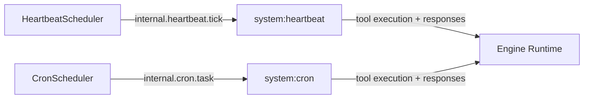

# ACTORS.md

Known agents, their roles, and signal subscriptions.

## Agents

| Name | Kind | Role |
|------|------|------|
| heartbeat worker (`system:heartbeat`) | system | Processes scheduled heartbeat signal events and executes heartbeat prompts. |
| cron worker (`system:cron`) | system | Processes scheduled cron signal events and executes cron prompts. |
| user sessions | user | Foreground user interaction, tool execution, and permission orchestration. |
| background sessions | cron/subagent/permanent | Autonomous task execution and orchestration flows. |

## Signal Subscriptions

| Agent | Pattern | Silent | Purpose |
|-------|---------|--------|---------|
| `system:heartbeat` | `internal.heartbeat.tick` | false | Receives scheduler heartbeat batches as direct signal events. |
| `system:cron` | `internal.cron.task` | false | Receives scheduler cron executions as direct signal events. |

## Wiring Diagram

## Notes

- Scheduler-originated internal signals are delivered directly and do not require persisted user subscriptions.
