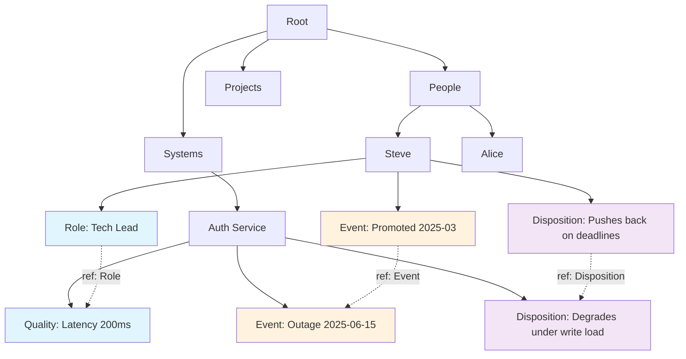
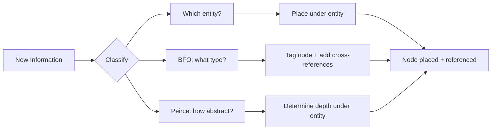

# Ontology Routing: Placing New Information in a Memory Graph

Given new information, classify it and route it to the correct node in a graph. The graph has a primary tree (entity-centric, traversed top-down) and cross-references (BFO-typed, linking related nodes across entities).

Every piece of incoming information gets two labels: **what it is** (BFO) and **how abstract it is** (Peirce). BFO determines the node's type tag and its cross-references. Peirce determines its depth within the entity.





## 1.0 Primary Tree — Entity-Centric

The tree is organized by **what you'd ask about**, not by ontological category.

¶1 **Depth 1: Domain Category** — noun title grouping related entities. "People", "Systems", "Projects", "Clients", "Processes". These emerge from the domain, not from BFO. Create them as needed.

¶2 **Depth 2: Entity** — a specific thing with its own identity. "Steve", "Auth Service", "Q3 Launch". Proper noun or unique identifier. One entity, one node. If two pieces of information are about the same entity, they go under the same node.

¶3 **Depth 3+: Detail** — everything you know about the entity. Each detail node gets a BFO type tag and a Peirce abstraction level. All actual content lives here.

¶4 **Rule: "tell me about X" must be answerable by traversing one subtree.** If you'd need to visit three different subtrees to answer a question about Steve, the tree is wrong. Everything about Steve goes under Steve.

### Minimum Depth

```
Depth 1: Category    (People, Systems, Projects...)
Depth 2: Entity      (Steve, Auth Service, Q3 Launch...)
Depth 3+: Detail     (what about it — tagged with BFO type)
```

Depth 1 and 2 are **structural only**. They hold children, never information. If intermediate nodes don't exist, create them before placing the detail.

## 2.0 BFO Classification — Type Tag + Cross-References

BFO does NOT determine where the node lives. It determines the node's **type tag** and which other nodes it **references** across the graph.

¶1 **Independent Continuant** — things that exist on their own.
- **Object** — bounded entity: person, system, org. Typically these ARE the depth-2 entity nodes themselves.
- **Collection** — group of objects: a team, a cluster.
- **Site** — environment or context: a region, a namespace, a market.

¶2 **Dependent Continuant** — properties that inhere in something.
- **Quality** — measurable: "latency is 200ms", "churn is 12%", "tone is formal."
- **Role** — contextual function: "Alice is tech lead", "this service acts as gateway."
- **Disposition** — latent capability or tendency: "can handle 10k RPS", "tends to push back."

¶3 **Occurrent** — things that unfold in time.
- **Process** — has duration, transforms: "deployment pipeline", "onboarding flow."
- **Event** — instantaneous: "deploy succeeded at 14:32", "user signed up."
- **State** — stable phase: "system is healthy", "project is blocked."

### Decision Tree

```
Is it a thing that exists on its own?
├─ YES → Independent Continuant
│   ├─ Bounded entity? → Object
│   ├─ Group of entities? → Collection
│   └─ Context/environment? → Site
├─ NO, it depends on a bearer
│   → Dependent Continuant
│   ├─ Measurable property? → Quality
│   ├─ Contextual function? → Role
│   └─ Latent capability? → Disposition
└─ NO, it unfolds in time
    → Occurrent
    ├─ Has duration + transformation? → Process
    ├─ Instantaneous boundary? → Event
    └─ Stable phase? → State
```

### Cross-Reference Rule

After placing a node under its entity, **add references to every other node in the graph that shares the same BFO type or that participates in the same fact.** This is what makes it a graph, not just a tree.

Examples:
- "Steve got promoted" (Event under Steve) → references "Q3 Launch completed" (Event under Projects) if the promotion was tied to it
- "Auth Service latency 200ms" (Quality under Auth Service) → references "API Response Time 340ms" (Quality under API Gateway) if they're related metrics
- "Alice is tech lead" (Role under Alice) → references "Auth Service" (Object under Systems) because the role is scoped to that system

**Every node with the same BFO type is a candidate for cross-reference.** Not all will be linked — only those that share a factual relationship. But the type tag makes them discoverable.

## 3.0 Peirce Classification — Depth Within Entity

Determines ordering among an entity's children. Shallow = abstract patterns, deep = raw data.

¶1 **Firstness (Raw Datum)** — direct observation, no interpretation. "CPU at 92%." "Steve said he's frustrated." "Deploy took 4 minutes." → **Deepest within entity.** Leaf nodes.

¶2 **Secondness (Causal Link)** — relationship between two things. "High CPU caused timeout." "Steve's frustration led to the rewrite." → **Intermediate.** Must reference ≥ 2 other nodes (which may be under different entities — this creates cross-references).

¶3 **Thirdness (Pattern / Rule)** — generalization from multiple observations. "This service degrades under write-heavy load." "Steve delivers best after deadline pressure." → **Shallowest within entity (but still depth 3+).** Must be supported by Secondness nodes beneath it.

### Depth Within Entity

```
Entity (depth 2 — structural)
├── Thirdness: patterns, rules (depth 3)
│   ├── Secondness: causal links (depth 4)
│   │   ├── Firstness: raw data (depth 5)
│   │   └── Firstness: raw data (depth 5)
│   └── Secondness: causal link
│       └── Firstness: raw data
└── Thirdness: another pattern
    └── ...
```

## 4.0 The Routing Algorithm

```
ROUTE(I, root):

  1. CLASSIFY
     bfo_type  ← ask §2.0 decision tree
     peirce    ← ask §3.0 → Firstness | Secondness | Thirdness

  2. IDENTIFY ENTITY
     Which entity is this about? Find or create:
     - Category node at depth 1 (create if missing)
     - Entity node at depth 2 (create if missing)
     current ← entity node

  3. DETERMINE DEPTH from Peirce level
     IF peirce == Thirdness:
       insert as direct child of entity (shallowest detail level)
     IF peirce == Secondness:
       insert below any Thirdness siblings, above Firstness
     IF peirce == Firstness:
       insert as leaf under most specific matching parent

  4. TAG
     Attach bfo_type to the new node as its type tag.

  5. CROSS-REFERENCE
     Scan the graph for related nodes:
     a) Same BFO type under different entities
        → add reference if factually related
     b) Nodes mentioned in this fact (for Secondness: both cause and effect;
        for Thirdness: the Secondness nodes it generalizes)
        → add reference regardless of where they live
     c) Same entity, different BFO type
        → add reference if they describe the same situation

     This step is what prevents information silos. "Steve got promoted"
     under People→Steve now references "Q3 Launch completed" under
     Projects→Q3 Launch and "Tech Lead role" under the same Steve node.

  6. CHECK
     - Duplicate? → merge, don't add
     - Contradicts sibling or ancestor? → keep both, flag conflict
     - Thirdness above now has ≥ 3 supporting nodes? → it's strong
     - Thirdness above loses last support? → it's weak
```

## 5.0 Conflict Resolution

¶1 **Same level, same parent, contradictory claims** — keep both. Do not silently overwrite. Surface the conflict on next retrieval.

¶2 **New Firstness contradicts existing Thirdness** — the pattern might be wrong. Attach the new datum under it. If contradicting data accumulates, flag the pattern for review.

¶3 **New Thirdness overlaps existing Thirdness** — check if one subsumes the other. If yes, make the narrower one a child of the broader one. If truly equivalent, merge. If partially overlapping, split into MECE sub-patterns.

¶4 **Temporal conflict** — same claim, different times. The newer one doesn't delete the older one; it supersedes it. Keep both.

¶5 **Cross-entity conflict** — two entities have contradictory claims about a shared fact. Both stay. Add references between them and flag the disagreement.

## 6.0 Worked Examples

### Example A: Something happens to a person

**Input:** "Steve got promoted to senior engineer on 2025-03-01"

```
1. CLASSIFY
   BFO: Event (instantaneous change)
   Peirce: Firstness (raw fact)

2. IDENTIFY ENTITY
   Category: "People"    (depth 1 — create if missing)
   Entity:   "Steve"     (depth 2 — create if missing)

3. DEPTH: Firstness → leaf under Steve
   Node title: "Promoted to senior engineer 2025-03"
   Tag: Event

4. CROSS-REFERENCE:
   → Does a "Q3 Launch" node exist under Projects? If the promotion
     was tied to it, add reference.
   → Does Steve already have a Role node "Junior Engineer"?
     If so, add reference (this Event changed that Role).
   → Any other Events in the graph around 2025-03? Reference if related.
```

### Example B: Raw metric

**Input:** "API response time hit 340ms at 2025-06-15T14:00Z"

```
1. CLASSIFY
   BFO: Quality (measurable property)
   Peirce: Firstness (raw measurement)

2. IDENTIFY ENTITY
   Category: "Systems"             (depth 1)
   Entity:   "API Gateway"         (depth 2)

3. DEPTH: Firstness → leaf under API Gateway
   Node title: "Response time 340ms at 2025-06-15"
   Tag: Quality

4. CROSS-REFERENCE:
   → Other Quality nodes under other Systems? (e.g., "Auth Service latency")
     Reference if they're correlated.
   → Any Secondness node like "High response time correlates with
     deploy frequency"? This datum supports it.
```

### Example C: Causal observation

**Input:** "Switching to connection pooling reduced DB timeouts by 60%"

```
1. CLASSIFY
   BFO: Process (change over time with outcome)
   Peirce: Secondness (causal link)

2. IDENTIFY ENTITY
   Category: "Systems"                  (depth 1)
   Entity:   "Database"                 (depth 2)

3. DEPTH: Secondness → intermediate under Database
   Node title: "Connection pooling reduced timeouts 60%"
   Tag: Process

4. CROSS-REFERENCE:
   → "Connection pooling" may also be an Object node under
     Systems→Infrastructure. Reference it.
   → "DB timeout rate" is a Quality under Database. Reference it.
   → These TWO references are mandatory for Secondness (cause + effect).
   → Does this + similar nodes support a Thirdness?
     If ≥ 3 Secondness nodes point to the same pattern, propose it.
```

### Example D: Learned principle

**Input:** "Users consistently abandon onboarding flows with more than 3 steps"

```
1. CLASSIFY
   BFO: Disposition (tendency)
   Peirce: Thirdness (general rule)

2. IDENTIFY ENTITY
   Category: "People"                (depth 1)
   Entity:   "Users"                 (depth 2, collective entity)

3. DEPTH: Thirdness → shallowest detail under Users
   Node title: "Abandon flows with >3 steps"
   Tag: Disposition

4. CROSS-REFERENCE:
   → Needs ≥ 2 supporting Secondness beneath it or elsewhere:
     e.g., "Flow A: 5 steps, 70% drop-off" under Projects→Onboarding
           "Flow B: 2 steps, 15% drop-off" under Projects→Onboarding v2
   → Reference both. These may live under different entities — that's fine,
     the references bridge them.
   → Check for broader Thirdness like "Shorter flows convert better"
     under the same or different entity. If found, this is a child of that.
```

## 7.0 Maintenance Heuristics

¶1 **Promote on evidence** — when a Secondness gains its 3rd supporting Firstness, it's strong. When a Thirdness gains its 3rd supporting Secondness, it's reliable. Surface strong patterns to the user.

¶2 **Decay on silence** — nodes that are never accessed or referenced lose relevance. Don't delete — demote. Move to an archive subtree after threshold.

¶3 **Split on growth** — if any node accumulates more than 7 children, split into sub-categories (MECE). The parent becomes a category node, children redistribute.

¶4 **Rebalance on contradiction** — if most of a Thirdness node's supporting nodes are contradicted, demote it to a contested claim. Don't let stale patterns persist.

¶5 **Merge on redundancy** — during traversal, if two sibling nodes have > 80% semantic overlap, merge them. Keep the richer one, redirect references from the other.

¶6 **Prune dead references** — when a node is merged or archived, update all nodes that reference it. Stale references are noise.