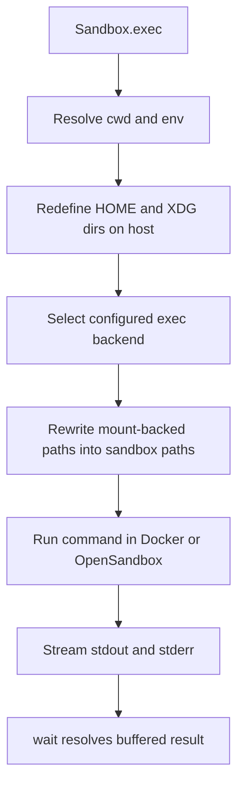

# Sandbox

The `Sandbox` class is the unified I/O layer for agent-scoped filesystem and command execution.

## Purpose

`Sandbox` centralizes:
- secure file reads (`read`)
- secure file writes (`write`)
- sandboxed command execution (`exec`)

This keeps tool modules focused on UX/schema formatting while enforcing one consistent security boundary.

`Sandbox.exec()` now returns a streaming handle with `stdout`, `stderr`, `wait()`, and `kill()`.
Call `Sandbox.execBuffered()` when a tool needs the older buffered result shape.

## Construction

```ts
import { Sandbox } from "@/types";

const sandbox = new Sandbox({
    homeDir: userHome.home,
    permissions: state.permissions,
    mounts: [
        { hostPath: userHome.skillsActive, mappedPath: "/shared/skills" },
        { hostPath: examplesDir, mappedPath: "/shared/examples" }
    ],
    backend: {
        type: "docker",
        docker: {
            socketPath: "/var/run/docker.sock",
            runtime: "runsc",
            readOnly: false,
            unconfinedSecurity: false,
            capAdd: [],
            capDrop: [],
            allowLocalNetworkingForUsers: [],
            userId: ctx.userId
        }
    }
});
```

Inputs:
- `homeDir`: sandbox HOME and default write root
- `workingDir`: derived from `permissions.workingDir` and cannot be overridden at construction
- `permissions`: session permissions used by read/write checks
- `mounts` (optional): extra mount points for virtual paths (e.g. `/shared/skills`). Home is always mounted at `/home` automatically.
- `backend`: required exec backend config (`docker` or `opensandbox`)

## API

### `read(args)`

```ts
await sandbox.read({ path, offset, limit });
```

Behavior:
- resolves relative paths from `workingDir`
- enforces `sandboxCanRead`
- blocks direct symlink reads
- detects supported image formats and returns `type: "image"`
- supports raw binary mode (`binary: true`) and raw text mode (`raw: true`)

### `write(args)`

```ts
await sandbox.write({ path, content, append });
```

Behavior:
- requires absolute path
- enforces `sandboxCanWrite`
- blocks direct symlink writes
- creates parent directories
- writes string or binary content via file handle
- returns both host `resolvedPath` and agent-facing `sandboxPath` (`~/...` when inside `homeDir`)

### `exec(args)`

```ts
const execution = await sandbox.exec({ command, cwd, timeoutMs, env, dotenv, secrets });
execution.stdout.on("data", (chunk) => process.stdout.write(chunk));
await execution.kill("SIGTERM");
const result = await execution.wait();
```

### `execBuffered(args)`

```ts
const result = await sandbox.execBuffered({ command, cwd, timeoutMs, env, dotenv, secrets });
```

Behavior:
- resolves `cwd` inside workspace scope
- optionally loads dotenv values (`dotenv: true` uses `cwd/.env`, string uses explicit path)
- merges env in order: `process.env` -> dotenv -> explicit `env` -> resolved `secrets`
- always runs with `HOME = homeDir`
- dispatches through the configured exec backend
- exposes live stdout/stderr streams from the backend
- supports `kill(signal)` for the running command tree
- preserves the same mounted paths regardless of backend
- leaves outbound networking enabled; there is no per-command domain allowlist
- `execBuffered()` preserves the legacy buffered `SandboxExecResult` shape for existing callers

## Execution Flow



## Backend Settings

Docker remains the default:

```json
{
    "sandbox": {
        "backend": "docker"
    },
    "docker": {
        "socketPath": "/var/run/docker.sock",
        "runtime": "runsc",
        "readOnly": false,
        "unconfinedSecurity": false,
        "capAdd": ["NET_ADMIN"],
        "capDrop": ["MKNOD"],
        "allowLocalNetworkingForUsers": ["user-admin"],
        "isolatedDnsServers": ["1.1.1.1", "8.8.8.8"],
        "localDnsServers": ["192.168.0.1"]
    }
}
```

OpenSandbox is configured separately:

```json
{
    "sandbox": {
        "backend": "opensandbox"
    },
    "opensandbox": {
        "domain": "http://localhost:8080",
        "apiKey": "optional-api-key",
        "image": "ubuntu",
        "timeoutSeconds": 600
    }
}
```

The Docker image is fixed in code to `daycare-runtime:latest`. OpenSandbox uses the image supplied in settings.

Path mapping uses the generic mount list. Home is always `/home`, extra mounts use their `mappedPath`:
- host: `/data/users/<userId>/home/...` → container: `/home/...`
- host: `/data/users/<userId>/skills/active/...` → container: `/shared/skills/...`

## Tool Context

`ToolExecutionContext` now exposes `sandbox` as the primary I/O dependency.

```ts
const text = await context.sandbox.read({ path: "notes.txt" });
await context.sandbox.write({ path: "/tmp/out.txt", content: "ok" });
const result = await context.sandbox.execBuffered({ command: "ls -la" });
```
