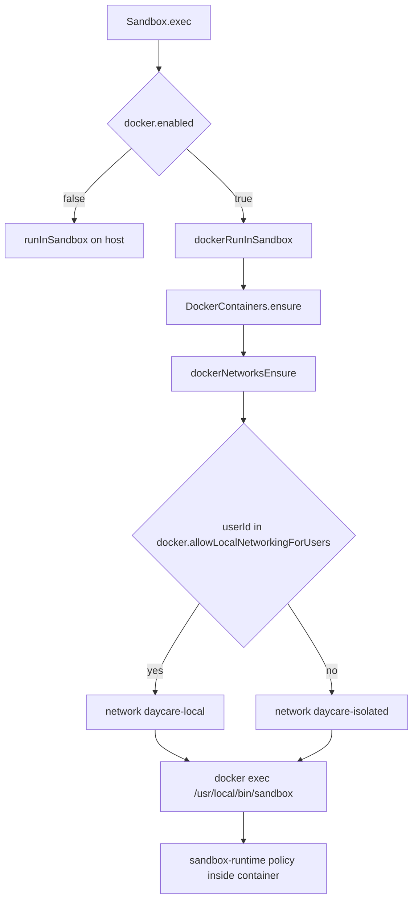
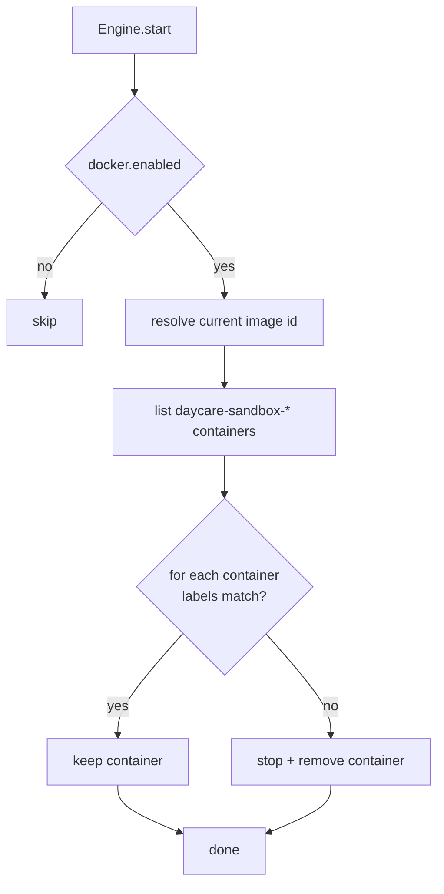

# Sandbox Docker Runtime

The sandbox Docker runtime adds a container layer around a thin `sandbox` wrapper binary for `sandbox-runtime` execution.

## What Runs Where

- `Sandbox.read()` and `Sandbox.write()` run on the host filesystem.
- `Sandbox.exec()` runs in a long-lived Docker container when Docker is enabled.
- The host user home (`<usersDir>/<userId>/home`) is bind-mounted to `/home` in the container.
- The host active skills root (`<usersDir>/<userId>/skills/active`) is bind-mounted read-only to `/shared/skills`.

## Settings

Configure Docker runtime in `settings.json`:

```json
{
    "docker": {
        "enabled": true,
        "image": "daycare-sandbox",
        "tag": "latest",
        "socketPath": "/var/run/docker.sock",
        "runtime": "runsc",
        "enableWeakerNestedSandbox": false,
        "readOnly": false,
        "unconfinedSecurity": false,
        "capAdd": ["NET_ADMIN"],
        "capDrop": ["MKNOD"],
        "allowLocalNetworkingForUsers": ["user-admin"],
        "isolatedDnsServers": ["1.1.1.1", "8.8.8.8"],
        "localDnsServers": ["192.168.0.1"]
    }
}
```

Defaults when omitted:

- `enabled`: `false`
- `image`: `daycare-sandbox`
- `tag`: `latest`
- `socketPath`: `undefined` (Docker default)
- `runtime`: `undefined` (Docker default)
- `enableWeakerNestedSandbox`: `false`
- `readOnly`: `false`
- `unconfinedSecurity`: `false`
- `capAdd`: `[]`
- `capDrop`: `[]`
- `allowLocalNetworkingForUsers`: `[]`
- `isolatedDnsServers`: `["1.1.1.1", "8.8.8.8"]`
- `localDnsServers`: `[]`

When `unconfinedSecurity` is `true`, sandbox containers are created with:

- `SecurityOpt: ["seccomp=unconfined", "apparmor=unconfined"]`

When `capAdd`/`capDrop` are set, sandbox containers are created with matching Docker capability options:

- `HostConfig.CapAdd`
- `HostConfig.CapDrop`

When `readOnly` is `true`, sandbox containers are created with:

- `HostConfig.ReadonlyRootfs: true`

The `/home` bind mount remains writable, so only mounted home content is writable while the rest of the root filesystem
is read-only.

All sandbox containers mount `/tmp`, `/run`, `/var/tmp`, and `/var/run` as writable tmpfs:

- `HostConfig.Tmpfs["/tmp"] = "rw"`
- `HostConfig.Tmpfs["/run"] = "rw"`
- `HostConfig.Tmpfs["/var/tmp"] = "rw"`
- `HostConfig.Tmpfs["/var/run"] = "rw"`
- Docker `Sandbox.exec()` includes `/tmp`, `/run`, and `/var/tmp` in `sandbox-runtime` `allowWrite`.
- `Sandbox.exec()` intentionally excludes `/var/run` because `sandbox-runtime` already maps `/run` and fails when
  `/var/run` is explicitly listed.

When `enableWeakerNestedSandbox` is `true`, `Sandbox.exec()` includes this runtime config:

- `enableWeakerNestedSandbox: true`

## Execution Flow



## Docker Network Isolation

- Every Docker sandbox user is isolated by default on `daycare-isolated`.
- Users listed in `docker.allowLocalNetworkingForUsers` are placed on `daycare-local`.
- `daycare-isolated` containers use `docker.isolatedDnsServers` (defaults to public resolvers).
- `daycare-local` containers use Docker's default DNS unless `docker.localDnsServers` is configured.
- When DNS servers are configured, Daycare bind-mounts a generated `/etc/resolv.conf` so runtime resolution does not rely on Docker's embedded `127.0.0.11` resolver.
- If an existing container is attached to the wrong network (for example after settings changes), it is stopped, removed, and recreated on the expected network.

## Image Version Guard

Each sandbox container is stamped at creation time with:

- `daycare.image.version` from `DOCKER_IMAGE_VERSION` in `dockerImageVersion.ts`
- `daycare.image.id` from `docker image inspect` (`dockerImageIdResolve`)
- `daycare.security.profile` from `docker.unconfinedSecurity`
- `daycare.capabilities` from `docker.capAdd`/`docker.capDrop`
- `daycare.readonly` from `docker.readOnly`
- `daycare.network` from selected Docker network (`daycare-isolated` or `daycare-local`)
- `daycare.dns.profile` from DNS policy (`public`, `private`, or `default`)
- `daycare.dns.servers` from configured DNS servers (`default` when Docker DNS is used)
- `daycare.tmpfs.tmp` fixed to `"1"` when `/tmp` tmpfs mount is enabled
- `daycare.tmpfs.run` fixed to `"1"` when `/run` tmpfs mount is enabled
- `daycare.tmpfs.var_tmp` fixed to `"1"` when `/var/tmp` tmpfs mount is enabled
- `daycare.tmpfs.var_run` fixed to `"1"` when `/var/run` tmpfs mount is enabled

`dockerContainerEnsure` compares these labels against current values. If any label is missing or mismatched, the
container is treated as stale, then stopped and removed; recreation with fresh labels is deferred to the same ensure
flow.

At engine startup, when Docker is enabled, Daycare scans all `daycare-sandbox-*` containers and proactively removes
stale ones before normal startup continues.



### Bumping `DOCKER_IMAGE_VERSION`

Bump `DOCKER_IMAGE_VERSION` manually when sandbox image behavior changes in an incompatible way:

1. Update `DOCKER_IMAGE_VERSION` in `dockerImageVersion.ts` (e.g. `"1"` -> `"2"`).
2. Deploy/restart engine.
3. Startup removes stale containers, and ensure recreates containers lazily when execution needs them.

## Path Translation

- Host to container: `pathMountMapHostToMapped()`
- Container to host: `pathMountMapMappedToHost()`

Examples:

- Host: `/data/users/u123/home/desktop/project`
- Container: `/home/desktop/project`
- Host: `/data/users/u123/skills/active/core--scheduling`
- Container: `/shared/skills/core--scheduling`

The runtime rewrites:

- sandbox-runtime filesystem policy paths (`allowWrite`, `denyRead`, `denyWrite`)
- `cwd`
- HOME-related environment variables
