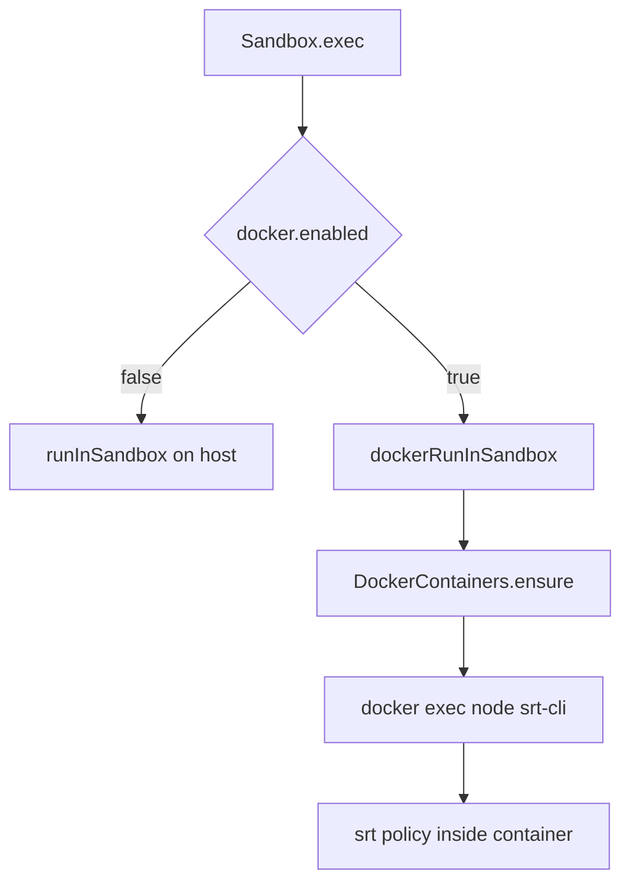

# Sandbox Docker Runtime

The sandbox Docker runtime adds a container layer around `sandbox-runtime` (`srt`) command execution.

## What Runs Where

- `Sandbox.read()` and `Sandbox.write()` run on the host filesystem.
- `Sandbox.exec()` runs in a long-lived Docker container when Docker is enabled.
- The host user home (`<usersDir>/<userId>/home`) is bind-mounted to `/home/<userId>` in the container.

## Settings

Configure Docker runtime in `settings.json`:

```json
{
    "docker": {
        "enabled": true,
        "image": "daycare-sandbox",
        "tag": "latest",
        "socketPath": "/var/run/docker.sock",
        "runtime": "runsc"
    }
}
```

Defaults when omitted:

- `enabled`: `false`
- `image`: `daycare-sandbox`
- `tag`: `latest`
- `socketPath`: `undefined` (Docker default)
- `runtime`: `undefined` (Docker default)

## Execution Flow



## Path Translation

- Host to container: `sandboxPathHostToContainer()`
- Container to host: `sandboxPathContainerToHost()`

Examples:

- Host: `/data/users/u123/home/desktop/project`
- Container: `/home/u123/desktop/project`

The runtime rewrites:

- srt filesystem policy paths (`allowWrite`, `denyRead`, `denyWrite`)
- `cwd`
- HOME-related environment variables
