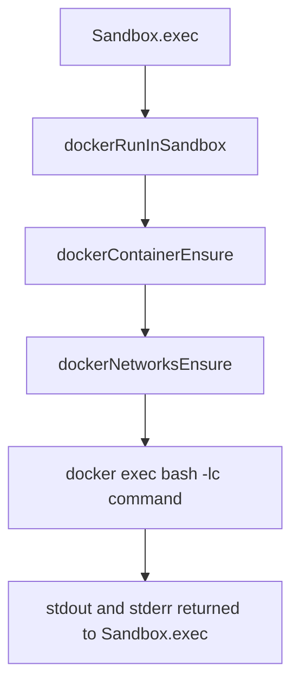

# Sandbox Docker Runtime

The sandbox Docker runtime is the only execution path for `Sandbox.exec()`.

## What Runs Where

- `Sandbox.read()` and `Sandbox.write()` run on the host filesystem.
- `Sandbox.exec()` runs in a long-lived per-user Docker container.
- The fixed runtime image is `daycare-runtime:latest`.
- The host user home (`<usersDir>/<userId>/home`) is bind-mounted to `/home`.
- The host active skills root is bind-mounted to `/shared/skills`.
- Any additional sandbox mounts are exposed at their configured `mappedPath`.

## Settings

Configure the Docker runtime in `settings.json`:

```json
{
    "docker": {
        "socketPath": "/var/run/docker.sock",
        "runtime": "runsc",
        "readOnly": false,
        "unconfinedSecurity": false,
        "capAdd": ["NET_ADMIN"],
        "capDrop": ["MKNOD"],
        "allowLocalNetworkingForUsers": ["user-admin"],
        "isolatedDnsServers": ["1.1.1.1", "8.8.8.8"],
        "localDnsServers": ["192.168.0.1"]
    }
}
```

Defaults when omitted:

- `socketPath`: `undefined` (Docker default)
- `runtime`: `undefined` (Docker default)
- `readOnly`: `false`
- `unconfinedSecurity`: `false`
- `capAdd`: `[]`
- `capDrop`: `[]`
- `allowLocalNetworkingForUsers`: `[]`
- `isolatedDnsServers`: `["1.1.1.1", "8.8.8.8"]`
- `localDnsServers`: `[]`

## Execution Flow


```mermaid
flowchart TD
    A[Sandbox.exec] --> B[dockerRunInSandbox]
    B --> C[dockerContainerEnsure]
    C --> D[dockerNetworksEnsure]
    D --> E[docker exec bash -lc command]
    E --> F[stdout and stderr returned to Sandbox.exec]
```

`dockerRunInSandbox()` rewrites mount-backed host paths into container paths before execution and normalizes
`TMPDIR`, `TMP`, and `TEMP` to `/tmp`.

## Docker Network Isolation

- Every Docker sandbox user is isolated by default on `daycare-isolated`.
- Users listed in `docker.allowLocalNetworkingForUsers` are placed on `daycare-local`.
- `daycare-isolated` containers use `docker.isolatedDnsServers`.
- `daycare-local` containers use Docker's default DNS unless `docker.localDnsServers` is configured.
- When DNS servers are configured, Daycare bind-mounts a generated `/etc/resolv.conf`.

Outbound network access is otherwise unrestricted once the command is running in the container.

## Container Refresh

Each sandbox container is labeled with the current runtime image id, network profile, DNS profile, capability
settings, and writable tmpfs settings. If those labels drift, the container is treated as stale and recreated.

At engine startup, Daycare validates that `daycare-runtime:latest` exists locally and removes stale
`daycare-sandbox-*` containers before normal startup continues.

## Path Translation

- Host to container: `pathMountMapHostToMapped()`
- Container to host: `pathMountMapMappedToHost()`

Examples:

- Host: `/data/users/u123/home/desktop/project`
- Container: `/home/desktop/project`
- Host: `/data/users/u123/skills/active/core--scheduling`
- Container: `/shared/skills/core--scheduling`
