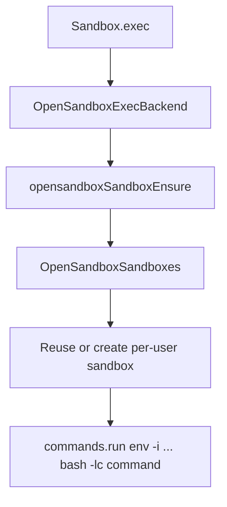

# Sandbox OpenSandbox Backend

This backend routes `Sandbox.exec()` through OpenSandbox while leaving `Sandbox.read()` and `Sandbox.write()` on the host filesystem.

## Settings

Configure the backend in `settings.json`:

```json
{
    "sandbox": {
        "backend": "opensandbox",
        "resourceLimits": {
            "cpu": 4,
            "memory": "16Gi"
        }
    },
    "opensandbox": {
        "domain": "http://localhost:8080",
        "apiKey": "optional-api-key",
        "image": "ubuntu",
        "timeoutSeconds": 600
    }
}
```

Required when `sandbox.backend` is `"opensandbox"`:
- `opensandbox.domain`
- `opensandbox.image`

When `sandbox.resourceLimits` is omitted, Daycare creates OpenSandbox instances with `4` CPU and `16Gi` memory.

## Volume Mapping

Daycare reuses the same mount model as Docker:
- `/home` maps to the user home directory and is read-write
- extra mounts such as `/shared/skills` and `/shared/examples` are read-only

OpenSandbox must allow those host paths on the server side.

## Lifecycle



`OpenSandboxSandboxes` keeps one sandbox per user in-process, renews TTL before expiry, and recreates the sandbox when the backend configuration changes.
