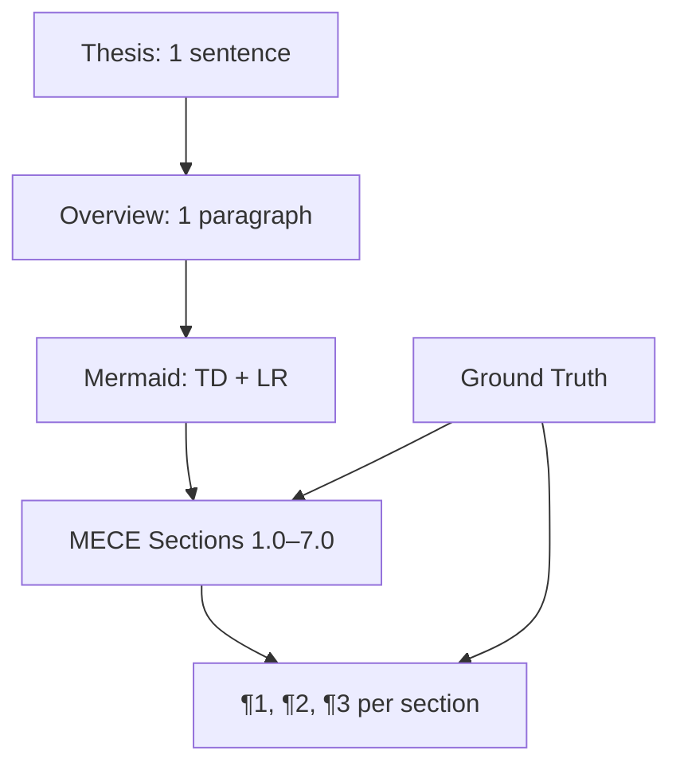

## How to Write a Document

Write docs like code. Fractal structure where each level is complete. No redundancy — reference, don't repeat. Every claim has a source.

## 1.0 The Stack

Six rules. Use internal names here for clarity — don't leak them into the actual doc output.

¶1 **Minto** — top-down. Thesis → overview → sections → details. Reader gets the point before the evidence.

¶2 **MECE** — sections don't overlap, but cover everything. 3–7 top-level sections. If you can't draw a clean boundary between two sections, merge them.

¶3 **BFO** — separate what exists (continuants) from what happens (occurrents). TD diagrams for structure, LR diagrams for process. This isn't decoration — it forces you to find the real shape of your content.

¶4 **Fractal** — each subsection mirrors the whole. Own thesis sentence, own diagram if needed, own numbered paragraphs. Expand only if it earns the depth.

¶5 **DRY** — each fact once. Cross-reference with §X.Y, don't restate.

¶6 **Ground truth** — every claim traces to a source. URL, file path, query, session ID, person. No source = no claim. See §4.0.

## 2.0 Structure

¶1 **Thesis** — one sentence. Specific outcome with who/what/when. Must preview the MECE sections that follow.

¶2 **Overview** — one paragraph expanding the thesis. Introduces each major section like a function docstring listing its parameters.

¶3 **Mermaid diagrams** — go right after the overview, before §1.0. Structure (TD) before process (LR). See §3.0.

¶4 **Sections** — numbered 1.0, 2.0, 3.0. Subsections 1.1, 1.2. State ordering logic upfront (importance / chronology / dependency). Continuant sections get noun titles, occurrent sections get verb titles.

¶5 **Paragraphs** — numbered ¶1, ¶2, ¶3 within each section. Order: general → specific, or problem → solution, or setup → action → result.

¶6 **Coherence** — if thesis says "planning, execution, monitoring", the doc must have all three. No surprise sections, no missing ones.

¶7 **Big docs** — over ~10 pages, split into linked files with proper relative paths.

## 3.0 Mermaid Diagrams

Every doc gets at least one diagram. Complex docs need both TD and LR.

¶1 **Headers required** — every diagram gets a bold header before the code block. Format: `**[Specific Description] ([Type] - [Direction]):**`. "Skill Package Structure (Continuant - TD)" not "System Structure".

¶2 **Continuant (TD/TB)** — what exists. Nodes are nouns (Database, API, User). Edges are "contains", "depends on", "is part of". Use for architecture, data models, component trees.

¶3 **Occurrent (LR)** — what happens. Nodes are verbs or states (Extract, Validate, Deploy). Edges are temporal — "then", "triggers", "flows to". Use for pipelines, workflows, request flows.

¶4 **Participation (optional)** — how continuants participate in occurrents. User triggers Pipeline which updates Database. TD or LR depending on emphasis.

¶5 **Sizing** — 5–12 nodes per diagram. More than that, split. Short labels (1–3 words). Label edges only when the relationship isn't obvious.

¶6 **Placement** — primary diagrams after overview, before §1.0. Section-level diagrams inline where needed. One diagram per abstraction level — deeper sections get smaller, focused diagrams.

¶7 **Structure first** — when showing both, continuant (TD) before occurrent (LR).

## 4.0 Ground Truth

Every piece of information traces to its source. No exceptions.

### Patterns

¶1 **External** — `**Source:** [Title](URL) (accessed YYYY-MM-DD)`

¶2 **Code** — `**Source:** path/to/file.py:123-145 (function calculate_metrics)`

¶3 **Session** — `**Generated by:** Claude Code session abc123 by Name (YYYY-MM-DD)`

¶4 **LLM reasoning** — `**LLM Analysis:** Based on ¶1 + ¶3` — flag synthesis explicitly, don't present it as source data.

¶5 **Query** — `**Query:** SELECT ... (YYYY-MM-DD)` with result and date. Data changes; timestamp matters.

¶6 **Human** — `**Expert input:** Name (Role), discussed YYYY-MM-DD`

¶7 **Meeting** — `**Source:** Gong call gong_123456 with Client (YYYY-MM-DD)` with key takeaway.

### Where to Put It

¶1 **Doc-level** — primary source right after the thesis in the overview.

¶2 **Section-level** — at top of section if the whole section comes from one source.

¶3 **Inline** — next to specific claims: "churn is 12% (**Source:** `SELECT AVG(churn_rate)...` 2025-11-10)".

¶4 **Mixed** — multiple sources in one paragraph, attribute each piece separately.

### Rules

- Dates mandatory. Always YYYY-MM-DD.
- URLs must work. Use archive.org if original might vanish.
- Code refs need line numbers or function names, not just file paths.
- "Based on research" is not a source. Name it.
- Synthesis presented as fact is a violation. Flag LLM reasoning.

## Checklist

Paste at doc end. Tick before shipping.

**Structure:**
- [ ] Thesis: one sentence previewing all sections
- [ ] Overview: one paragraph introducing each section
- [ ] Mermaid: at least one; complex docs get TD + LR
- [ ] MECE: 3–7 sections, no overlap, full coverage
- [ ] Ordering stated: ¶1 of each section explains sequence logic
- [ ] Paragraph numbering: ¶1, ¶2, ¶3 throughout
- [ ] Coherence: thesis matches actual sections

**Content:**
- [ ] DRY: each fact once, §X.Y cross-references elsewhere
- [ ] Dense: no filler words, but enough to execute
- [ ] Labels: noun titles for continuants, verb titles for occurrents

**Ground Truth:**
- [ ] Primary source in overview
- [ ] Section sources attributed
- [ ] Inline sources on specific claims
- [ ] LLM reasoning flagged
- [ ] Code refs have line numbers
- [ ] All dates present
- [ ] URLs tested
